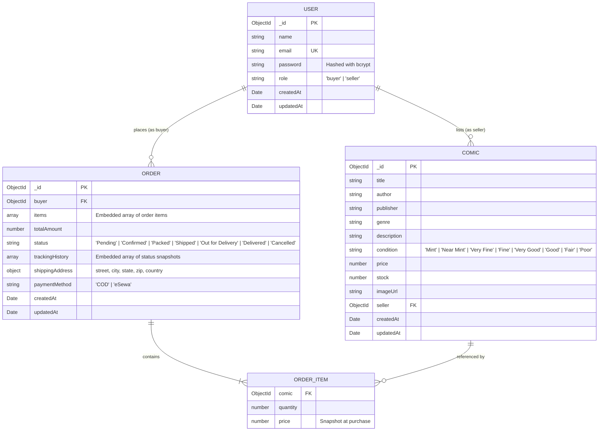

# ComicVerse (Selino) - Full Project Documentation

Welcome to **ComicVerse (Selino)**, a full-stack MERN comic book e-commerce and seller marketplace platform. This document provides complete architectural specifications, database schemas, authentication workflows, payment gateway integrations, and API references.

---

## Table of Contents

1. [Project Overview & Architecture](#1-project-overview--architecture)
2. [Database Design & Schemas](#2-database-design--schemas)
   - [Entity Relationship Diagram](#entity-relationship-diagram)
   - [User Model](#user-model)
   - [Comic Model](#comic-model)
   - [Order Model](#order-model)
3. [Authentication & JWT Session Architecture](#3-authentication--jwt-session-architecture)
   - [Dual Extraction Architecture](#dual-extraction-architecture)
   - [Cookie Configuration & Security](#cookie-configuration--security)
   - [Session Restoration Lifecycle](#session-restoration-lifecycle)
   - [Role-Based Access Control (RBAC)](#role-based-access-control-rbac)
4. [Payment Gateway Integrations](#4-payment-gateway-integrations)
   - [eSewa (ePay v2) Integration](#esewa-epay-v2-integration)
   - [Cash on Delivery (COD)](#cash-on-delivery-cod)
5. [API Endpoints Reference](#5-api-endpoints-reference)
   - [Authentication Endpoints](#authentication-endpoints)
   - [Comics Endpoints](#comics-endpoints)
   - [Orders & Tracking Endpoints](#orders--tracking-endpoints)
6. [Frontend State Management & Routing](#6-frontend-state-management--routing)
7. [Environment Variables & Setup Guide](#7-environment-variables--setup-guide)

---

## 1. Project Overview & Architecture

ComicVerse is designed with a decoupled client-server architecture:

```
[ Frontend: React 19 + Vite + Tailwind CSS v4 ]
                    │
           HTTP / JSON / Cookies
                    │
[ Backend: Node.js + Express 5 + Cookie Parser + Multer ]
                    │
         Mongoose ODM Queries
                    │
[ Database: MongoDB 27017 (selinoDB) ]
```

- **Frontend**: React 19 with Vite, Lucide Icons, and modern Comic-Book/Halftone UI aesthetic powered by Tailwind CSS v4.
- **Backend**: Express 5 on Node.js, providing RESTful endpoints, file uploads for comic covers via Multer, and HMAC-SHA256 signature generation for payments.
- **Database**: MongoDB with Mongoose ODM handling schema validation, relational object ID references, and query indexing.

---

## 2. Database Design & Schemas

### Entity Relationship Diagram



### User Model

File: `Backend/models/user.js`
Collection: `users`

| Field       | Type     | Required | Default   | Description                            |
| :---------- | :------- | :------- | :-------- | :------------------------------------- |
| `_id`       | ObjectId | Auto     | Auto      | Primary identifier                     |
| `name`      | String   | Yes      | -         | User alias or real name                |
| `email`     | String   | Yes      | -         | Unique user email (trimmed, lowercase) |
| `password`  | String   | Yes      | -         | Bcrypt hashed password (salt 10)       |
| `role`      | String   | Yes      | `"buyer"` | Access level: `"buyer"` or `"seller"`  |
| `createdAt` | Date     | Auto     | `now`     | Creation timestamp                     |
| `updatedAt` | Date     | Auto     | `now`     | Last update timestamp                  |

### Comic Model

File: `Backend/models/comic.js`
Collection: `comics`

| Field         | Type     | Required | Default             | Description                                |
| :------------ | :------- | :------- | :------------------ | :----------------------------------------- |
| `_id`         | ObjectId | Auto     | Auto                | Primary identifier                         |
| `title`       | String   | Yes      | -                   | Title of the comic book                    |
| `author`      | String   | Yes      | -                   | Writer / Illustrator name                  |
| `publisher`   | String   | No       | `"Unknown"`         | Publisher (Marvel, DC, etc.)               |
| `genre`       | String   | No       | `"Superhero"`       | Category / Genre                           |
| `description` | String   | No       | `""`                | Comic synopsis / edition details           |
| `condition`   | String   | No       | `"Fine"`            | Comic grading condition                    |
| `price`       | Number   | Yes      | -                   | Price per issue in Nepali Rupees (Rs. NPR) |
| `stock`       | Number   | No       | `1`                 | Available inventory count                  |
| `imageUrl`    | String   | No       | Default placeholder | URL or local static upload path            |
| `seller`      | ObjectId | Yes      | -                   | Reference to `User._id`                    |
| `createdAt`   | Date     | Auto     | `now`               | Creation timestamp                         |

### Order Model

File: `Backend/models/order.js`
Collection: `orders`

| Field             | Type     | Required | Default     | Description                             |
| :---------------- | :------- | :------- | :---------- | :-------------------------------------- |
| `_id`             | ObjectId | Auto     | Auto        | Order transaction ID                    |
| `buyer`           | ObjectId | Yes      | -           | Reference to `User._id`                 |
| `items`           | Array    | Yes      | `[]`        | Array of `{ comic, quantity, price }`   |
| `totalAmount`     | Number   | Yes      | -           | Calculated aggregate purchase total     |
| `status`          | String   | Yes      | `"Pending"` | Current logistics stage                 |
| `trackingHistory` | Array    | No       | `[]`        | Array of `{ status, note, timestamp }`  |
| `shippingAddress` | Object   | Yes      | -           | `{ street, city, state, zip, country }` |
| `paymentMethod`   | String   | Yes      | -           | `"COD"` or `"eSewa"`                    |
| `createdAt`       | Date     | Auto     | `now`       | Order placement timestamp               |

---

## 3. Authentication & JWT Session Architecture

ComicVerse utilizes a **hybrid authentication system** that supports both secure **HTTP-only Cookies** and standard **Authorization Bearer tokens**.

### Dual Extraction Architecture

Protected routes run through `Backend/middleware/auth.js` which verifies requests through two channels:

1. **HTTP-only Cookie**: Checks `req.cookies.token`. The browser automatically includes this cookie with every cross-origin request when `credentials: "include"` is set.
2. **Authorization Header**: Checks `req.headers.authorization` for `Bearer <token>` as a robust fallback.

```javascript
// Middleware Token Resolution
let token = null;
if (req.cookies && req.cookies.token) {
  token = req.cookies.token;
} else if (
  req.headers.authorization &&
  req.headers.authorization.startsWith("Bearer ")
) {
  token = req.headers.authorization.split(" ")[1];
}
```

### Cookie Configuration & Security

Tokens have a validity of **30 days**, avoiding frequent logouts:

- `httpOnly: true`: Prevents client-side scripts from reading the cookie, mitigating Cross-Site Scripting (XSS) token theft.
- `secure`: Set to `true` in production (HTTPS).
- `sameSite`: Set to `"lax"` in development and `"none"` in production cross-origin deployments.
- `maxAge`: `30 * 24 * 60 * 60 * 1000` (30 days).

### Session Restoration Lifecycle

When the user visits the app or reloads a page:

1. The React `AuthProvider` runs `verifyAuth` on mount.
2. It sends a `GET /api/auth/profile` request with `credentials: "include"`.
3. The browser automatically attaches the stored HTTP-only cookie.
4. The server validates the JWT and returns the user object (`id`, `name`, `email`, `role`).
5. The frontend updates state without requiring user credentials.
6. When logging out, `POST /api/auth/logout` explicitly invokes `res.clearCookie("token")`.

### Role-Based Access Control (RBAC)

Middleware functions enforce authorization:

- `authMiddleware`: Validates token and attaches `req.user`.
- `isSeller`: Restricts comic management and seller orders to users with `role === "seller"`.
- `isBuyer`: Restricts order checkout to users with `role === "buyer"`.

---

## 4. Payment Gateway Integrations

ComicVerse supports 2 payment options in Nepali Rupees (NPR):

```
[ Checkout Form (Cart.jsx) ]
           │
           ├── [COD] ────────────► Creates order with "Pending" status
           │
           └── [eSewa] ──────────► Generates HMAC-SHA256 signature ──► POST to eSewa API ──► Redirects to Home Page (/)
```

### eSewa (ePay v2) Integration

- **Signature Creation**: Uses HMAC-SHA256 with merchant secret key:
  ```javascript
  const message = `total_amount=${totalAmount},transaction_uuid=${transactionUuid},product_code=${productCode}`;
  const signature = crypto
    .createHmac("sha256", process.env.ESEWA_SECRET_KEY)
    .update(message)
    .digest("base64");
  ```
- **Redirect Flow**:
  1. Frontend submits a hidden HTML `<form>` directly to eSewa (`https://rc-epay.esewa.com.np/api/epay/main/v2/form`).
  2. On successful payment, eSewa redirects to `success_url`:
     ```
     ${frontendUrl}/?payment=esewa&order=${orderId}&status=success
     ```
  3. The home page displays a celebratory notification banner confirming order placement.

### Cash on Delivery (COD)

- Direct order placement without external redirects.
- Order is logged with `"COD"` payment method and immediate `"Pending"` state.

---

## 5. API Endpoints Reference

### Authentication Endpoints

Base URL: `/api/auth`

| Method | Endpoint    | Access        | Description                                                                     |
| :----- | :---------- | :------------ | :------------------------------------------------------------------------------ |
| `POST` | `/register` | Public        | Register new account (`name`, `email`, `password`, `role`). Sets 30-day cookie. |
| `POST` | `/login`    | Public        | Authenticate user. Sets 30-day cookie. Returns user info and token.             |
| `POST` | `/logout`   | Public        | Clears authentication cookie.                                                   |
| `GET`  | `/profile`  | Authenticated | Returns logged-in user profile from cookie or Bearer token.                     |

### Comics Endpoints

Base URL: `/api/comics`

| Method   | Endpoint | Access         | Description                                                       |
| :------- | :------- | :------------- | :---------------------------------------------------------------- |
| `GET`    | `/`      | Public         | Get all comics. Supports `?search=`, `?genre=`, and `?sellerId=`. |
| `GET`    | `/:id`   | Public         | Get comic details by ID.                                          |
| `POST`   | `/`      | Seller Only    | Create new comic listing (accepts multipart image or JSON URL).   |
| `PUT`    | `/:id`   | Seller (Owner) | Update an existing listing.                                       |
| `DELETE` | `/:id`   | Seller (Owner) | Delete a comic listing.                                           |

### Orders & Tracking Endpoints

Base URL: `/api/orders`

| Method | Endpoint      | Access         | Description                                                         |
| :----- | :------------ | :------------- | :------------------------------------------------------------------ |
| `POST` | `/`           | Buyer Only     | Checkout order (COD or eSewa). Decrements comic stock.              |
| `GET`  | `/buyer`      | Buyer Only     | Retrieve order history for the logged-in buyer.                     |
| `GET`  | `/track/:id`  | Authenticated  | View tracking timeline and current status of an order.              |
| `GET`  | `/seller`     | Seller Only    | Retrieve sales, earnings, and orders containing the seller's items. |
| `PUT`  | `/:id/status` | Seller (Owner) | Update order status and append note to tracking timeline history.   |

---

## 6. Frontend State Management & Routing

- **AuthContext** (`Frontend/src/context/authContext.jsx`):
  - Provides `user`, `token`, `loading`, `login()`, `register()`, `logout()`.
  - Runs silent cookie-based profile verification on application initialization.
- **CartContext** (`Frontend/src/context/cartContext.jsx`):
  - Provides cart items persistence in `localStorage`.
  - Helper functions: `addToCart()`, `removeFromCart()`, `updateQuantity()`, `clearCart()`, `getCartTotal()`, `getCartCount()`.
- **Protected Routing**:
  - Automatically handles authorization guards with non-blocking loaders (`loading` check prevents premature login redirects).
  - Seller dashboard enables tracking timeline visualizers and status update selectors.

---

## 7. Environment Variables & Setup Guide

### Backend Configuration (`Backend/.env`)

```env
PORT=4000
MONGO_DB_URL=mongodb://127.0.0.1:27017/selinoDB
JWT_SECRET=your_jwt_secret_key_comicverse
FRONTEND_URL=http://localhost:5173

# eSewa merchant credentials (UAT testing defaults)
ESEWA_SECRET_KEY=8gBm/:&EnhH.1/q
ESEWA_PRODUCT_CODE=EPAYTEST
ESEWA_PAYMENT_URL=https://rc-epay.esewa.com.np/api/epay/main/v2/form
```

### Running the Project

1. **Start MongoDB**:

   ```bash
   mongod
   ```

2. **Start Backend**:

   ```bash
   cd Backend
   npm install
   npm run dev
   ```

   _Runs on `http://localhost:4000`_

3. **Start Frontend**:
   ```bash
   cd Frontend
   npm install
   npm run dev
   ```
   _Runs on `http://localhost:5173`_
